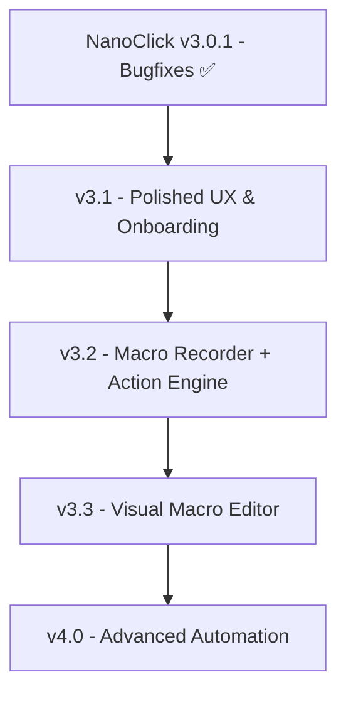

# 📊 NanoClick — Roadmap та Сравнительный Анализ

Документ порівняння концепції автоклікера із поточним станом **NanoClick v4.0**, виявлення точок покращення та формування плану розвитку.

> **Поточна версія:** v4.0 (зібрано `cargo build --release` — ~9.94 MB exe, 57/57 tests ✅)
> **Детальна архітектура:** [`docs/MACRO_ARCHITECTURE.md`](./docs/MACRO_ARCHITECTURE.md) · [`docs/v4_CONTROL_FLOW.md`](./docs/v4_CONTROL_FLOW.md)

> **Ключова відмінність від конкурентів:** NanoClick — це **перший macro recorder, де Smart Normalizer обов'язковий за замовчуванням**. Користувач ніколи не бачить micro-events (1000 MouseMove × 50), якщо сам цього не хоче. Після запису доступна кнопка **⚡ Optimize** (3 рівні агресивності) для ще більшого очищення. Контекстне меню `⋮` на блоці дає Run from here / Step / Disable (замість Delete) / Duplicate.
>
> **v4.0 унікальність:** Control-flow з коробки — `Repeat` (loops), `Condition::VarEq/Lt/Gt/PixelEquals` (branches), `Call` (sub-macros), `SetVar/GetVar` (state). Жоден з конкурентів (Jitbit, Pulover's, Macro Recorder) не має execution-time умов — тільки linear playback.

---

## 1. � ПОРІВНЯЛЬНА ТАБЛИЦЯ МОЖЛИВОСТЕЙ

| Можливість / Функція | Запропонована Концепція | Поточний Стан у NanoClick v3.0.1 | v3.2 план |
| :--- | :--- | :--- | :--- |
| **Кнопки миші** | Left, Right, Middle, X1 (Side 1), X2 (Side 2) | ✅ Ліва, Права, Середня, Бокова 1 (X1), Бокова 2 (X2) у Win32 backend та UI | + Click/Move/Down/Up у Actions |
| **Типи кліків** | Single, Double, Hold | ✅ Single, Double, Hold | + Усі Click = окремі Actions |
| **Інтервал кліків** | CPS / ms | ✅ 1.0 – 100.0 CPS (Rust timer) | Без змін |
| **Повтори / Ліміт** | Нескінченно (∞) або N разів | ✅ Нескінченно (0) або N кліків | + `RepeatMode::Times(n)` на макрос |
| **Позиціонування** | Курсор або Фіксовані X, Y | ✅ Курсор або Фіксовані (X, Y) | + `MouseMove { x, y }` у Actions |
| **Рандомізація (Jitter)** | Інтервал + просторовий | ✅ Часовий 0-30% **+ Просторовий `jitter_radius_px`** | Без змін |
| **Затримка старту (Start Delay)** | Зворотний відлік (сек) | ✅ 1-300 сек, в Rust worker | Без змін |
| **Умови зупинки (Stop Conditions)** | Кліки, тривалість, точна година | ✅ Усі в Rust worker loop | Без змін |
| **Global Hotkeys** | Глобальні клавіші | ✅ 6 комбінацій через `WH_KEYBOARD_LL` hook | + `Ctrl+Shift+R` Record |
| **Профілі / Пресети** | Збереження конфігів (JSON) | ✅ **Presets Manager V2** (event delegation, XSS-safe) | Без змін |
| **Експорт / Імпорт пресетів** | `.json` файли | ✅ «📤 Експорт» / «📥 Імпорт» | + Macro export/import |
| **Безпека (Work Mode)** | Блокування hotkeys | ✅ **Work Mode** | Без змін |
| **Багатоточковий клікер** | Послідовність (X, Y) точок | 🔴 Базовий вибір 1 точки | ✅ **Стає частиною Macro:** `Move → Click → Move → Click → Wait` |
| **Macro Recorder** | Запис дій → макрос | 🔴 Відсутній | ✅ **v3.2:** WH_KEYBOARD_LL + WH_MOUSE_LL capture, mouse simplification |
| **Visual Macro Editor** | Редагування записаного | 🔴 Відсутній | ✅ **v3.3:** inline edit, drag-reorder, re-record |
| **Keyboard + Scroll у макросі** | Key press, scroll wheel | 🔴 Відсутній | ✅ **v3.2:** KeyPress/Down/Up, Scroll actions |
| **Advanced Automation** | Loops, conditions, profiles | 🔴 Відсутній | 🔴 **v4.0:** Repeat{count, inner}, If{...}, Call{macro_id}, profiles |

---

## 2. ✅ ЩО У НАС ВЖЕ Є (v3.0.1)

1. **⚡ Високоточне Rust Ядро (`src-tauri`):**
   - Windows Waitable Timer (`CreateWaitableTimerExW` з high-res + accumulator) та окремі системні треди.
2. **🛡️ Унікальний Робочий Режим (Work Mode):**
   - Блокує системні хуки при роботі з текстом.
3. **🎯 Менеджер Пресетів V2 (JSON Persistence + Export/Import):**
   - Один `innerHTML` через `.map().join()` + event delegation, XSS-safe `escapeHtml()`.
4. **🖱️ Повна Підтримка 5 Кнопок Миші (Win32 SendInput):**
   - Left, Right, Middle, X1, X2.
5. **⏱️ Розумні Таймери (Rust scheduler):**
   - Start Delay, Stop Duration, Stop Time — у Rust worker loop, синхронно з click-loop.
6. **🎨 Дизайн-Система:**
   - 6 тем + акцентні свотчі.
7. **⌨️ WH_KEYBOARD_LL Hook для Hotkeys:**
   - Zero CPU на idle.

---

## 3. 🚀 ОНОВЛЕНИЙ ROADMAP



> **Чому переглянуто:** старий план (`v3.2 Multi-Point → v4.0 Macro`) дублював сутності. Multi-Point = просто послідовність Click actions, яку легше описати через єдиний Action Engine. Macro Recorder — це **центральна фішка**, а не пункт у списку.

### 📦 v3.0.1 — "Hotfix & Performance" (✅ РЕАЛІЗОВАНО)
- WH_KEYBOARD_LL hook, jitter_radius_px, Rust timers, presets perf.

### 📦 v3.1 — "Presets & Polished UX"
- [ ] Onboarding flow для нових користувачів.
- [ ] Empty states покращити ("Create your first preset").
- [ ] Status hints та tooltips.
- [ ] **Presets (залишаються у вкладці Presets, refactor всередині):**
  - [ ] Empty state: "No presets yet — create your first".
  - [ ] Preset cards: групування за категоріями (Combat / Utility / Game-specific).
  - [ ] Search box над сіткою пресетів.
  - [ ] Keyboard shortcuts на apply (цифри 1-9 = перші 9 пресетів).
  - [ ] Recently used section (топ-3 за останні 7 днів).
- [ ] **⚠️ Макроси НЕ тут.** Макроси — окрема сутність, живуть у вкладці **Automation** (див. v3.2). Не змішувати presets і macros в одному списку.

### 📦 v3.2 — "Macro Recorder + Action Engine" (наступний великий реліз)
- [ ] `Action` enum + serde JSON schema (`MouseMove`, `MouseClick`, `MouseDown`, `MouseUp`, `KeyPress`, `KeyDown`, `KeyUp`, `Scroll`, `Wait`).
- [ ] `Macro` struct + storage в `AppConfig.macros`.
- [ ] **Вкладка Automation** як окрема sidebar page — **3-й пункт одразу праворуч від Presets**.
  - Поточна sidebar ordering (з `index.html`):
    ```
    Dashboard → Presets → Automation → Settings → Hotkeys → Statistics → About
    ```
  - Усі макроси живуть тут (поряд з Presets, але окремо — не всередині, не під).
  - Не змішувати з Presets — це різні концепції (конфіг engine vs послідовність дій).
- [ ] Event recorder: `WH_KEYBOARD_LL` + `WH_MOUSE_LL` + cursor polling.
- [ ] **Smart Normalizer** (5 phases) — див. `docs/MACRO_ARCHITECTURE.md` §3.2 + §5.
- [ ] **Two recording modes:** ⚡ Smart (default) vs 🔬 Precise (raw).
- [ ] **Click/Hold pairing** (Down + Up → Click або Hold залежно від тривалості).
- [ ] **Double-click detection** (opt-in).
- [ ] **Mouse coalescing** (> 20 px threshold).
- [ ] **Keyboard normalization** (Down+Up → KeyPress; комбінації модифікаторів).
- [x] Auto-Wait insertion між подіями (< 25 ms drop, > 60s split).
- [ ] Overlay UI під час запису (translucent always-on-top window).
- [ ] Player: linear Action executor (reuses `click_mouse_ext` + `PlatformTimer`).
- [ ] Automation page: My Macros list + Record/Build entry points.
- [ ] Hotkey: `Ctrl+Shift+R` toggle record (default).
- [ ] **Multi-Point Clicker автоматично з'являється** як частина Macro Recorder — без окремого модуля.

### 📦 v3.3 — "Visual Macro Editor"
- [ ] Inline edit (delay value, coordinates, key, button) — `docs/MACRO_ARCHITECTURE.md` §6.2.
- [ ] Drag-to-reorder (HTML5 DnD) — §6.3.
- [ ] Add/Delete actions через dropdown — §6.4.
- [ ] **⚡ Optimize button** (post-recording normalization pass, 3 рівні агресивності) — §6.5.
- [ ] **Context menu ⋮:** Run from here / Step / Edit / Duplicate / Disable / Delete — §6.6.
- [ ] **Disable vs Delete** (3-state checkbox: enabled / disabled / deleted) — §6.7.
- [ ] **Step execution & Run-from-here** (debug mode з phase indicator) — §6.8.
- [ ] Re-record button (з confirm dialog).
- [ ] Save / Save As / Duplicate / Delete.
- [ ] Export macro як `.json` (shareable).
- [ ] Import macro з `.json`.

### 📦 v4.0 — "Advanced Automation"
- [ ] Loops: `Repeat { count, inner: Vec<Action> }`.
- [ ] Conditions: `If { predicate, then, else }` (наприклад, "if cursor color = red, click").
- [ ] Nested macros: `Call { macro_id }`.
- [ ] Profiles: load different macro sets by context (game detected / app focus).
- [ ] Hotkey-bound macro start (різний hotkey на кожен macro).

---

## 4. 🧠 Чому Macro Recorder — центральна фішка, а не пункт меню

**Старий UX (програмований автоматизатор):**
```
Automation → Create Macro → Add Action → Mouse → Click → Coordinate (X, Y)
                                              ↓
                                        Add Wait → Enter 300 ms
                                              ↓
                                        Add Click → Select Left
                                              ↓
                                        Add Wait → Enter 800 ms
                                              ↓
                                        ...
```
Користувач має вчити "мову макросів". Це морока.

**Новий UX (action recorder — "perform then refine"):**
```
[ 🔴 Record ]
      ↓
робиш потрібну дію вручну
      ↓
┌──────────────────────────┐
│ 🖱 Click                 │
│ ⏱️ Wait 742 ms           │
│ 🖱 Click                 │
│ ⏱️ Wait 1356 ms          │
│ 🖱 Scroll ↓              │
│ ⌨️ E                      │
└───────────�──────────────┘
            ↓
       редагуєш
```

Записаний макрос — це **чернетка**, не фінальний результат. Користувач бачить свої реальні дії перетворені на блоки, і може:
- Видалити зайві блоки (`ти випадково чекав 1.3 с, бо задумався → видалити Wait 1356 ms`).
- Змінити значення (клікнути на `742 ms` → ввести `1200 ms`).
- Змінити координати Move/Click.
- Re-record якщо зіпсував.

**Два шляхи створення одного й того ж макросу:**
```
              CREATE MACRO
                   │
          ┌────────┴────────┐
          ↓                 ↓
      🔴 Record          ＋ Build
          │                 │
   реальні дії        ручні блоки
          │                 │
          └────────┬────────┘
                   ↓
              Action List
                (Macro)
```

**Multi-Point Clicker тепер безкоштовно:**
- Записав `Move → Click → Move → Click → Move → Click` → готово.
- Або збудував вручну ті самі 6 actions.
- Жодного окремого `MultiPositionManager`.

---

## 5. 🔧 ТЕХНІЧНИЙ БОРГ v3.0.0 → v3.0.1 (закритий)

| # | Заявлено в v3.0.0 | Реальність v3.0.0 | Фікс v3.0.1 |
|---|---|---|---|
| 1 | "Low-level hooks (6 шт)" | Polling `GetAsyncKeyState` ~1% CPU | `SetWindowsHookExW(WH_KEYBOARD_LL)` |
| 2 | `jitter_radius_px` поле | Мертве поле | Реалізовано в `click_mouse_ext` |
| 3 | Start/Stop таймери | JS `setTimeout` (зникали при rerender) | Rust worker loop |
| 4 | Presets "responsive" | Повільний rerender | `innerHTML` + event delegation |
| 5 | Preset hover | `transform` → paint reflow | `border` + `shadow` (compositor) |
| 6 | `applyPreset()` | Копіював ~50% полів | Всі engine-поля з guard |

### Збірка v3.0.1
```
$ cd src-tauri && cargo build --release
warning: function `click_mouse` is never used  ← legacy
   Finished `release` profile [optimized] target(s) in 49.24s
$ ls -la target/release/NanoClick.exe
-rwxr-xr-x  9 385 984 bytes  NanoClick.exe  (≈9.4 MB)
```

### Застереження
- `cargo tauri build` НЕ працює (CLI 1.6.6 ≠ Tauri 2). Workaround: `cargo build --release` напряму. Perm fix: `cargo install tauri-cli --version "^2.0" --locked`.

---

## 6. 🆚 Як саме v3.2 перетворює Multi-Point на частину Macro

**Старий план v3.2 (відхилений):**
```
MultiPositionManager
├── points: Vec<(i32, i32)>
├── interval_ms: u64
└── repeat_mode: RepeatMode
```

**Новий план v3.2 (затверджений):**
```
Macro
├── actions: Vec<Action>
│   ├── MouseMove { x, y }
│   ├── MouseClick { button, count }
│   └── Wait { ms }
├── repeat_mode: RepeatMode
└── (no separate "points" field)
```

**Приклад "клікнути в 3 точки з паузою":**
```json
{
  "id": "macro-001",
  "name": "Triple Click",
  "actions": [
    { "type": "mouse_move", "x": 500, "y": 300 },
    { "type": "mouse_click", "button": "left", "count": 1 },
    { "type": "wait", "ms": 300 },
    { "type": "mouse_move", "x": 700, "y": 400 },
    { "type": "mouse_click", "button": "left", "count": 1 },
    { "type": "wait", "ms": 300 },
    { "type": "mouse_move", "x": 900, "y": 500 },
    { "type": "mouse_click", "button": "left", "count": 1 }
  ],
  "repeat_mode": { "type": "times", "count": 1 }
}
```

User flow:
- 🔴 Record → Move → Click → Wait → Move → Click → Wait → Move → Click
- АБО ＋ Build → додати 8 actions вручну

---

© 2026 NanoClick Development Roadmap.
**v3.0.1** (✅ Bugfix) → **v3.1** (✅ UX Polish) → **v3.2** (✅ Macro Recorder + Action Engine) → **v3.3** (✅ Visual Editor) → **v4.0** (✅ Advanced Control Flow).
Детальна архітектура Action Engine: [`docs/MACRO_ARCHITECTURE.md`](./docs/MACRO_ARCHITECTURE.md).
v4.0 Control Flow спека: [`docs/v4_CONTROL_FLOW.md`](./docs/v4_CONTROL_FLOW.md).
