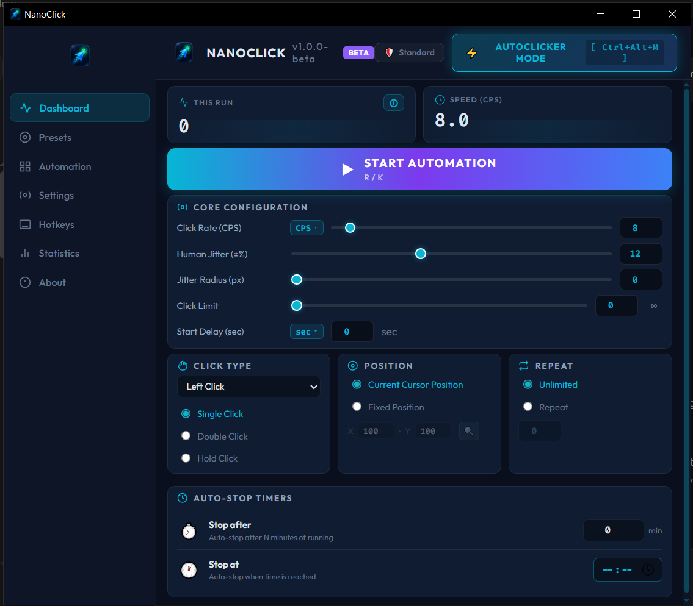

# ⚡ NanoClick

**A fast, modern Windows desktop automation tool** — autoclicker, macro recorder, and visual macro editor in one lightweight app.

Built with **Tauri 2 + Rust + vanilla JS**. No Electron, no bundler, no bloat: the production installer is **~3.5 MB**.

    

---

<p align="center">
  
</p>

---

## ✨ Features

### 🖱️ Click Engine
- **Single / Double / Hold** click modes with configurable press & pause durations
- **Gaussian Timing & Coordinate Variance** — Bates B3 human tremor (±0–35%, mean-of-3 bell concentrated near target CPS, strict bounds, no clamp) and spatial micro-dispersion (±0–50 px) within configurable variance thresholds
- **Position picker** — bind clicks to a fixed screen point or follow the cursor
- **Precise CPS control** (0.1–160 CPS) with live hotkey speed adjustment and real-time telemetry
- **Hover/Flyout Unit Switchers** — seamlessly toggle between CPS (Clicks/sec) and ms (Interval) directly from the dashboard

### 🎬 Smart Macro Recorder & Visual Editor
- **Two ways to create a macro:** 🔴 record real input in real-time, or ＋ build it from blocks manually
- **Ramer-Douglas-Peucker (RDP) Trajectory Simplification** — advanced curve reduction algorithm that compresses recorded drag mouse paths by 80–95% while keeping exact curvature
- **Smart Hover Path Elimination** — strips redundant intermediate hover movements, keeping only the precise target position before clicks/key actions
- **⚡ Optimize** — one-click macro cleanup at three aggressiveness levels (Subtle / Balanced / Aggressive)
- **Visual editor** — inline edit, rename, drag-to-reorder, context menu (Run from here / Step / Disable / Duplicate)

### 🧠 Control Flow & Smart Hotkeys
- **Zero-Lock Win32 Hooks** — thread-local event listeners for sub-millisecond hotkey response with zero interface stuttering
- **Smart Key Memory** — TTL-based keypress memory (configurable 100–3000ms) for effortless recording of complex hotkeys and modifier combinations (Ctrl, Alt, Shift, Win)
- **Multi-point Sequence Editor** — high-performance Canvas editor with O(1) transform caching and snap-to-grid
- **Advanced Automation Primitives** — `Repeat`, `If/Else` with pixel-color conditions, variables (`SetVar`/`GetVar`), and nested macro calls
- **Presets & Statistics** — save, import/export full engine presets and persist total click analytics across application updates

### 🌍 100% Tri-Lingual Internationalization (i18n)
- **Comprehensive coverage** across 🇺🇦 Ukrainian, 🇷🇺 Russian, and 🇬🇧 English (372 symmetric keys).
- **Zero-overhead memory footprint** — lazy loads only the chosen JSON locale on demand (~12 KB).
- **Instant reactive updates** — all static UI and dynamic runtime strings adapt immediately without restart.
- **One-Screen Welcome Matrix** — tri-lingual cyberpunk onboarding overlay with instant language switching and starter presets.

### 🛡️ Windows UIPI Security & Admin Elevation
- **Elevated Window Detection** — detects when hovering over elevated processes (Task Manager, admin consoles, protected games) to prevent dropped clicks.
- **Audio & Visual Alerts** — synthesized chime warning and informative dialogue when Windows UIPI blocks `SendInput`.
- **One-Click Admin Restart** — instant UAC prompt (`runas`) and Windows Compatibility Layer registry persistence (`~ RUNASADMIN`).

### 🖥️ Per-Monitor V2 DPI Scaling & Manifest Stability
- **PerMonitorV2 awareness** — zero coordinate drift across mixed DPI multi-monitor configurations.
- **Full Side-by-Side Windows Manifest** — integrates `Microsoft.Windows.Common-Controls` v6.0.0.0 and OS compatibility tags.

### 🛡️ Safety, Reliability & Self-Healing
- **Smart Typing Guard (Default ON)** — auto-stops clicking when typing real text and locks out hotkeys (600ms default); features a 2-second intentional safety cooldown before disarming
- **Auto-Pause on Focus Loss (FocusGuard)** — opt-in guard that stops the clicker the moment the foreground app changes mid-run (Alt+Tab, click-away, Win key, system toast); session baseline via the 300ms `ForegroundCache`, fail-open on unresolvable focus, UI toast explains the pause
- **Remember Window Position** — restores the last main-window position on launch; coordinates persist in the same atomic config save and are sanitized against the virtual screen (off-screen → auto-center)
- **Self-Healing Configuration Engine** — Last Known Good snapshots (`config.last_good.json` / `macros.last_good.json`, hardened readonly+hidden "black box"), timestamped quarantine (`*.broken-<epoch>`, visible), Deadbolt Modal queue (mandatory OK, no X/backdrop/Esc), and an observer watcher (1s poll, debounce, runtime toasts only — never rewrites files)
- **Factory Reset with 5-Second Cooldown** — safe reset button with auto-backup (`config.json.bak`) and "Think (5)" confirmation modal
- **Always on Top Window Toggle** — keeps the interface floating during full-screen games or workflows
- **Zero-Latency Stop & Fast Double-Tap** — stops clicking instantly on keypress (0ms) without debounce blocking
- **Work Mode** — suspends global hotkeys while you're using other applications
- **Auto-pause on navigation**, emergency stop (<kbd>Escape</kbd>), start-delay & auto-stop timers
- **Floating HUD** overlay for real-time click tracking
- **Windows autostart + system tray** integration
- 🎨 **6 Themes**: Dark Cyberpunk, Neon Grass, Dark Slate, Midnight Blue, Dracula Crimson, Amethyst Purple

---

## ⌨️ Default Hotkeys

| Action | Keys |
|---|---|
| Start / Stop autoclicker | <kbd>R</kbd> / <kbd>K</kbd> / <kbd>F6</kbd> |
| Toggle Autoclicker ↔ Work Mode | <kbd>Ctrl+Alt+M</kbd> |
| Emergency stop | <kbd>Escape</kbd> |
| Speed up (+1 CPS) | <kbd>Ctrl+=</kbd> |
| Slow down (−1 CPS) | <kbd>Ctrl+−</kbd> |
| Capture screen coordinates | <kbd>Ctrl+P</kbd> |
| Start / Stop macro recording | <kbd>Ctrl+Shift+R</kbd> |

All hotkeys are handled by an event-driven `WH_KEYBOARD_LL` listener in Rust — zero busy-polling at idle, sub-millisecond reaction time.

---

## 📦 Install

Download the `v1.0.0-beta` installer from [Releases](https://github.com/Ar3ss12/nanoclick/releases/tag/v1.0.0-beta):

```
NanoClick_1.0.0-beta_x64-setup.exe   (~2.2 MB)
NanoClick-portable.exe               (~4.9 MB, zero-install)
```

- Installs per-user (no admin rights needed)
- Uses the system WebView2 runtime; downloads it automatically if missing
- Updates are delivered through the built-in updater (signed artifacts)

---

## 🛠️ Build from Source

**Prerequisites:** [Rust](https://rustup.rs) (stable-msvc), Microsoft C++ Build Tools, WebView2 (preinstalled on Windows 10/11).

```bash
# 1. Clone
git clone https://github.com/Ar3ss12/nanoclick.git
cd nanoclick

# 2. Run in dev mode
cargo tauri dev

# 3. Or build the release installer (NSIS)
cargo tauri build --bundles nsis
# → target/release/bundle/nsis/NanoClick_*-setup.exe
```

### Run tests

```bash
cd src-tauri
cargo test -- --skip physical_
# → 158 passed; 0 failed (148 unit + 10 integration)
```

The test suite covers:
- **i18n Key Symmetry & DOM Validation** — 100% 3-way synchronization across UA, RU, and EN (337 keys + 18 notice keys × 3 locales)
- **Windows UIPI & Elevation Integration** — token privilege checks and app manifests
- **Stats Triple-Redundancy** — `config.json` + `stats.json` + `localStorage` fallback
- **Stats Session Lifecycle** — exactly-once finalize (no double-flush twins), junk-run filter (`<5 clicks & <1s` skipped from chart), dirty-flag 5s flush (zero disk writes in idle), ring-capped history (50 entries, ~6 KB ceiling)
- **Modal Scrollability & Trap Immunity** — Escape handlers and backdrop closes across all overlays
- **Win32 Hook routing** & physical input matching (`SendInput`, Numpad, Mouse X-Buttons)
- **Normalizer 5-phase pipeline** & RDP mouse trajectory simplification
- **Recorder handle idempotency** & thread safety
- **Hotkey debouncing** & config persistence

---

## 🏗️ Architecture

```
┌────────────────────────────  Frontend (vanilla JS) ───────────────────────────┐
│  UI · presets · visual macro builder · IPC via window.__TAURI__.core.invoke  │
└──────────────────────────────────────┬───────────────────────────────────────┘
                                       │ Tauri commands (12)
┌──────────────────────────────────────▼───────────────────────────────────────┐
│                              Rust backend                                     │
│  ┌───────────┐  ┌────────────┐  ┌─────────────┐  ┌────────────────────────┐  │
│  │ Scheduler │  │  Recorder  │  │ Persistence │  │ Platform (windows/)    │  │
│  │ CPS loop, │  │ WH_MOUSE/  │  │ config.json │  │ SendInput injection,   │  │
│  │ timers,   │→ │ KEYBOARD_LL│  │ macros.json │  │ WH_KEYBOARD_LL hotkeys,│  │
│  │ control   │  │ normalizer │  │ presets     │  │ single-instance lock   │  │
│  └───────────┘  └────────────┘  └─────────────┘  └────────────────────────┘  │
└──────────────────────────────────────────────────────────────────────────────┘
```

- **All timing runs on a Rust worker thread** — UI never drives the click loop
- **Exactly-once session finalize** — `stats.js` writes one history entry per run: the `active→idle` transition is the single entry point, late 66ms worker echoes are no-ops (`!activeNow` early return + monotonic guard), so no more timestamp twins 7–40ms apart
- **Junk-run filter** — accidental hotkey taps (`<5 clicks` and `<1s`) grow the counters but never pollute the history chart
- **Dirty-flag stats flush** — disk writes only when clicks happened (START, STOP-finalize, 5s flush while dirty); idle app performs zero disk writes, `history` ring-capped at 50 entries (~6 KB ceiling)
- **Lazy secondary WebViews** — cold boot creates only the `main` window (`tauri.conf.json` declares no `overlay`/`hud`). The fullscreen ripple overlay and floating HUD are built on demand via `WebviewWindowBuilder` (`ensure_overlay_window` / `ensure_hud_window`), shown only after their transparent DOM renders (Zero-Flash), and fully `destroy()`ed when toggled off — idle RAM holds zero secondary WebViews
- **66 ms (15 FPS) IPC telemetry** — click counter & status updates come from a dedicated background worker reading lock-free atomics, keeping IPC overhead negligible even at 160 CPS
- **No extra Chromium flags** — `WEBVIEW2_ADDITIONAL_BROWSER_ARGUMENTS` is deliberately unset: in-process GPU mode would merge Chromium's GPU into our process and hang the click/hook thread on a DirectX reset (see `docs/ZERO_JITTER_ISOLATION_PLAN.md`); RAM is saved by lazy windows instead
- **Global hotkeys** use an event-driven channel (hook → mpsc → matcher), not polling
- **Zero-Lock Hooks** — `thread_local!` state avoids mutex contention on high-frequency input
- **Updater**: artifacts signed with a minisign keypair; verification is mandatory and built into Tauri's updater plugin

---

## 📁 Project Structure

```
nanoclick/
├── src/                  # Frontend (no bundler):
│   ├── locales/          #   i18n JSON dictionaries: ua.json, ru.json, en.json (337 keys)
│   ├── i18n.js           #   Zero-dependency lightweight lazy-loading i18n engine
│   ├── stats.js          #   Modular analytics & live Canvas CPS chart engine
│   ├── uipi_manager.js   #   Windows UIPI detection, audio chime & elevation UI
│   ├── main.js           #   Core UI logic, state bindings, presets & visual editor
│   ├── index.html        #   Main application structure & data-i18n bindings
│   └── style.css         #   Cyberpunk/Neon themes, modal layouts & responsive styles
├── src-tauri/
│   ├── src/
│   │   ├── core/         # Action engine, executor, conditions
│   │   ├── recorder/     # Raw event capture, Smart Normalizer (RDP), optimizer
│   │   ├── scheduler.rs  # Click loop, CPS, timers, stop events
│   │   ├── persistence/  # Config, macros, presets (+ migrations, stats)
│   │   ├── platform/     # windows/ (hooks, input, uipi.rs) + backend traits
│   │   └── lib.rs        # Tauri commands, setup, logging, DPI initialization
│   ├── build.rs          # Windows application manifest (ComCtl32 v6.0 + PerMonitorV2)
│   ├── capabilities/     # Tauri 2 permission manifests
│   └── tauri.conf.json
└── scripts/              # release.ps1 (automated build, sign and GitHub release)
```

---

## 🔒 Signing & Updates

NanoClick uses two independent signing systems:

| System | Purpose | Status |
|---|---|---|
| **Tauri updater signing** (minisign keypair, free) | Proves update artifacts are authentic | ✅ Active — `.sig` generated per build |
| **Windows code signing** (certificate, paid) | Removes SmartScreen warnings | ⏳ Awaiting certificate |

Build a signed installer locally (private key stays outside the repo):

```powershell
# Private updater key is stored OUTSIDE the repository, e.g. $env:USERPROFILE\.tauri\
# and provided via environment variables at build time. Never commit it.
$env:TAURI_SIGNING_PRIVATE_KEY = (Get-Content $env:TAURI_SIGNING_PRIVATE_KEY_PATH -Raw).Trim()
cargo tauri build --bundles nsis
```

> ⚠️ Keep the private updater key safe — installations already shipped only trust
> updates signed with the same key they were built with.

---

## 📄 License

NanoClick is licensed under the **PolyForm Noncommercial License 1.0.0** plus the
NanoClick Additional Terms (branding policy, permitted gaming/streaming uses,
commercial-use examples, governing law). See [`LICENSE.md`](LICENSE.md) for the
full text — the license file is the single source of truth and is bundled with
each release.

### 📋 License at a Glance

| Activity / Use Case | Status | Terms |
|---|:---:|---|
| **Personal automation & productivity** | ✅ YES | Free for personal, hobby, and educational use |
| **Gaming & community play** | ✅ YES | Permitted for personal gameplay and automation |
| **Streaming on Twitch / YouTube** | ✅ YES | Streaming and monetized video content creation are 100% permitted |
| **Source inspection & forks** | ✅ YES | Open for study; public redistributions must rebrand |
| **Selling .exe / commercial licenses** | ❌ NO | Selling binaries or charging for access is strictly prohibited |
| **Commercial bot-farms / paid services** | ❌ NO | Automated commercial operations require a commercial license |
| **Adware / miner bundling** | ❌ NO | Strictly prohibited |

© 2026 Ar3ss12 · All rights not expressly granted are reserved.

---

## 🌟 Star History

<p align="center">
  <a href="https://star-history.com/#Ar3ss12/nanoclick&Date">
    <picture>
      <source media="(prefers-color-scheme: dark)" srcset="https://api.star-history.com/svg?repos=Ar3ss12/nanoclick&type=Date&theme=dark" />
      <source media="(prefers-color-scheme: light)" srcset="https://api.star-history.com/svg?repos=Ar3ss12/nanoclick&type=Date" />
      
    </picture>
  </a>
</p>

---

<p align="center">Built with ❤️ using <a href="https://tauri.app">Tauri</a></p>

