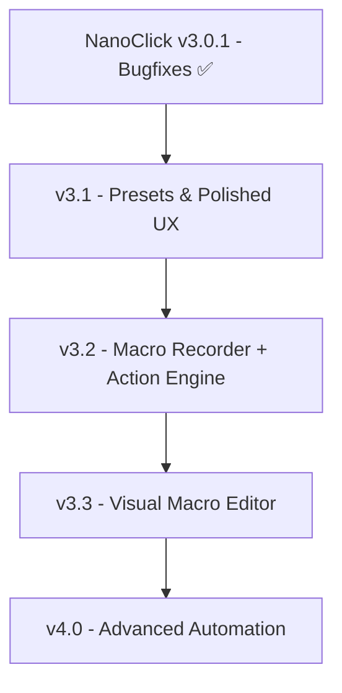

# 🧠 NanoClick — Macro / Action Engine Architecture (v3.2 + v4.0)

> **Філософія:** *Don't program the automation. Perform it once. Then refine it.*
>
> Замість чотирьох окремих систем (`MultiPointClicker`, `MacroEngine`, `ClickEngine`, `KeyboardRecorder`) — **одне ядро**: Action Engine. Звичайний автоклікер, багатоточковий клік, записаний макрос, ручний редактор і control-flow — це **різні способи створення одного списку Actions**.

> **Поточна версія:** v4.0 (зібрано `cargo build --release` — ~9.94 MB exe, 57/57 tests ✅)
> **v4.0 доповнення:** 5 нових Action variants для control-flow — `Repeat`, `If`, `Call`, `SetVar`, `GetVar`. Деталі у [`docs/v4_CONTROL_FLOW.md`](./v4_CONTROL_FLOW.md).

---

## 1. 🧩 Чому один Action Engine замість N систем

| Раніше (v3.0.1 план) | Тепер (v3.2) |
|---|---|
| `MultiPointClicker` — послідовність (X,Y) точок | Спрощується: це просто `Move → Click → Wait → Move → Click` |
| `MacroEngine` — довільні дії | Те саме ядро, тільки довші ланцюги |
| `ClickEngine` — поточний scheduler | Те саме ядро, тільки детерміністичний `Click → Wait → Click` |
| `KeyboardRecorder` — окремий запис | Один event recorder для миші + клавіатури + скролу |

**Виграш:** один набір типів, один recorder, один player, один формат збереження, один UI для редагування. Жодного дублювання.

---

## 2. 📦 Action — єдиний тип

```rust
/// Single atomic step in a macro. Stored in JSON, executed by the player,
/// rendered in the visual editor as one editable block.
#[derive(Debug, Clone, Serialize, Deserialize)]
#[serde(tag = "type", rename_all = "snake_case")]
pub enum Action {
    /// Move the cursor to an absolute screen coordinate.
    /// Generated automatically when mouse position changes by > threshold
    /// during recording (see §5 — Mouse simplification).
    MouseMove { x: i32, y: i32 },

    /// Press + release a mouse button at the current cursor position.
    /// `count = 2` produces a double-click (SendInput with two events).
    MouseClick {
        button: MouseButton,   // Left | Right | Middle | X1 | X2
        count: u8,             // 1 = single, 2 = double
    },

    /// Press and hold a mouse button (no release). Use for "hold" mode.
    /// Always paired with a later `MouseUp` for the same button.
    MouseDown { button: MouseButton },

    /// Release a previously-held mouse button.
    MouseUp { button: MouseButton },

    /// Press + release a keyboard key.
    /// `mods` captures Ctrl/Alt/Shift/Win state at recording time.
    KeyPress {
        key: KeyCode,                  // 'E', 'F1', 'Escape', 'Space', ...
        mods: Modifiers,               // bitflags: Ctrl | Alt | Shift | Win
    },

    /// Press and hold a key (no release). Always paired with KeyUp.
    KeyDown { key: KeyCode, mods: Modifiers },

    /// Release a previously-held key.
    KeyUp { key: KeyCode, mods: Modifiers },

    /// Scroll wheel delta. Positive = down (away from user), negative = up.
    /// We record native WHEEL_DELTA units (120 = one notch) and replay as-is.
    Scroll { delta_x: i32, delta_y: i32 },

    /// Pause for N milliseconds. Generated automatically between any two
    /// consecutive recorded events, OR inserted manually.
    Wait { ms: u64 },

    /// Begin holding left mouse button indefinitely (no release) until the
    /// macro ends or a matching MouseUp is encountered.
    /// Used to model "hold mode" as a continuous action in long sequences.
    HoldStart,
}

/// A macro is a named, ordered list of Actions with metadata.
#[derive(Debug, Clone, Serialize, Deserialize)]
pub struct Macro {
    pub id: String,
    pub name: String,
    pub icon: String,                        // emoji like '🎬'
    pub actions: Vec<Action>,
    pub repeat_mode: RepeatMode,             // Once | Times(n) | UntilStopped
    pub repeat_count: u32,
    pub created_at: i64,
    pub updated_at: i64,
}
```

**Properties:**
- Все серіалізується в JSON (serde tagged enum — стабільна схема, читається в Python/JS).
- Детерміністичне виконання: `Wait { ms: 300 }` — це `std::thread::sleep` або точніше через `PlatformTimer::wait_until`.
- Idempotent: `MouseDown { Left }` + `MouseUp { Left }` можна виконати двічі без шкоди (другий `Down` просто no-op, бо кнопка вже натиснута).

---

## 3. 🎬 Recorder — "Don't program, perform"

### 3.1 Hotkey

`Ctrl + Shift + R` — toggle recording (configurable в Hotkeys page).

### 3.2 Capture pipeline (повний, з Smart Normalizer)

```
┌─────────────────────────────────────────────────────────────┐
│  WH_KEYBOARD_LL + WH_MOUSE_LL hooks (Windows)              │
│  + periodic GetCursorPos polling (тільки для MouseMove)     │
└──────────────────────┬────────────────────────────────────┘
                       ↓ (raw events, ~60-1000 Hz)
┌─────────────────────────────────────────────────────────────┐
│  RAW EVENT STREAM                                           │
│  - MouseMove    (x, y, t)                                   │
│  - MouseDown    (button, t)                                 │
│  - MouseUp      (button, t)                                 │
│  - KeyDown      (vk, mods, t)                               │
│  - KeyUp        (vk, mods, t)                               │
│  - Scroll       (dx, dy, t)                                │
└──────────────────────┬─────────────────────────────────────│
                       ↓
┌─────────────────────────────────────────────────────────────┐
│  ✅ SMART NORMALIZER (recorder/normalizer.rs)               │
│                                                             │
│  Phase 1: Click/Hold pairing                               │
│    Down + Up within 200ms → CLICK                          │
│    Down + Up with > 200ms gap → HOLD (with duration)        │
│                                                             │
│  Phase 2: Double-click detection                           │
│    CLICK + WAIT < 100ms + CLICK → DOUBLE_CLICK             │
│    (opt-in via setting; default ON)                         │
│                                                             │
│  Phase 3: Mouse coalescing                                 │
│    MouseMove × N (during wait period) → single MOVE        │
│    Only when Smart mode is active                          │
│    Mode "Record every movement" → bypasses this phase      │
│                                                             │
│  Phase 4: Keyboard normalization                           │
│    Down E + Up E (within 50ms) → KEY_PRESS E               │
│    Down Ctrl + Down C + Up C + Up Ctrl → KEY_PRESS Ctrl+C   │
│    Long key holds (typing) → separate KeyDown/Up keys      │
│                                                             │
│  Phase 5: Wait insertion                                   │
│    Between any two consecutive events:                      │
│    - < 25 ms → DROP (micro-action noise)                   │
│    - 16-60000 ms → insert Wait(delta)                      │
│    - > 60000 ms → split into 60-s blocks                   │
│    - Last trailing Wait → DROP                             │
│                                                             │
└──────────────────────┬────────────────────────────────────┘
                       ↓ (clean Action list)
┌─────────────────────────────────────────────────────────────┐
│  Action list — stored in Macro.draft                        │
│  Re-rendered in real-time in the Editor (block list)        │
└────────────────────────────────────────────────────────────┘
```

### 3.3 On-screen overlay

Під час запису показуємо невеликий overlay (translucent, top-right):

```
┌────────────────────────────────────────┐
│ � RECORDING     00:04.27              │
│ Ctrl+Shift+R again to stop             │
│ 7 actions captured                     │
└────────────────────────────────────────┘
```

Реалізація: Tauri window без decorations, `transparent: true`, `always_on_top: true`. Або WebView-only DOM-overlay в межах головного вікна. **TBD в v3.2.**

### 3.4 Auto-generated Wait between events

Кожна пара сусідніх events отримує `Wait` з дельтою часу між ними:

```
[Event A at t=0]     → Wait(742) →     [Event B at t=742]
```

**Edge cases:**
- Wait < 25 ms → **drop** (це мікрошум запису).
- Wait > 60 000 ms (1 хв) → **split** на 60-сек блоки (для зручності редагування).
- Останній Wait після фінальної події → **drop** (не зберігаємо "час після закінчення").

---

## 4. ▶️ Player — виконання макросу

```rust
pub struct MacroPlayer {
    scheduler: Arc<ClickScheduler>,
    current_macro: Arc<Mutex<Macro>>,
    is_playing: AtomicBool,
    cancel_token: Arc<AtomicBool>,
}

impl MacroPlayer {
    pub fn play(&self) {
        // Spawn a worker thread (same model as ClickScheduler)
        // Loop over actions:
        //   - MouseMove: SetCursorPos(x, y)
        //   - MouseClick: click_mouse_ext(button, "single"/"double", "fixed", x, y, 0)
        //   - MouseDown: press without release
        //   - MouseUp: release
        //   - KeyPress/Down/Up: SendInput with virtual key code
        //   - Scroll: SendInput(WHEEL) with delta
        //   - Wait: PlatformTimer::wait_until(target, stop_event)
        // Cancellation points: before every action check cancel_token
    }
}
```

**Integration with existing scheduler:**
- Reuse `click_mouse_ext()` для `MouseClick` (вже має jitter, X1/X2, double).
- Reuse `PlatformTimer` для `Wait`.
- Add new `key_press()` / `mouse_down()` / `mouse_up()` / `scroll()` in `platform/windows.rs`.
- Reuse existing global hotkeys: `Ctrl+Shift+R` toggle record, `Esc` (or new) stop play.

**Important:** Player respects Work Mode. If Work Mode is active, Play refuses to start (same guard as existing `set_active`).

---

## 5. 🧹 Smart vs Precise — два режими запису

### 5.1 Чому два режими

**Конкуренти (Macro Recorder, Jitbit, Pulover):** raw event list → user має розбиратися.

**NanoClick:** Smart mode за замовчуванням — користувач ніколи не бачить event spam, якщо сам цього не хоче.

### 5.2 Setting

```
Recording mode:
(●) ⚡ Smart (recommended)
(○) 🔬 Precise (raw events)
```

### 5.3 Що робить Smart Normalizer (детально)

**Phase 1: Click/Hold pairing**
```
MouseDown Left  →  180ms  →  MouseUp Left    →  MouseClick(Left, 1)
MouseDown Left  →  1200ms →  MouseUp Left    →  HoldStart + Wait(1200) + (no MouseUp → assume end-of-macro)
```

**Phase 2: Double-click detection**
```
MouseDown → 80ms → MouseUp → 50ms → MouseDown → 80ms → MouseUp
                                                          ↓
                                              MouseClick(Left, 2) — DOUBLE
```
- Threshold: < 100 ms between two clicks.
- Opt-in checkbox `☑️ Detect double-clicks` (default ON).
- Disable якщо користувач реально хоче два окремі clicks.

**Phase 3: Mouse coalescing (Smart mode тільки)**
```
Під час wait period:
  MouseMove (500,300) × 50 raw events
  + Wait (немає значущих подій)
       ↓ Smart
  MouseMove(500, 300)   ← один action

Перед Click:
  MouseMove (745,398)
  MouseMove (749,400)
  MouseMove (750,400)
  MouseDown Left
       ↓ Smart
  MouseMove(750, 400) + MouseClick(Left, 1)
```
- Threshold: рух записується тільки якщо позиція змінилась > 20 px від останнього "значущого" руху.
- Значущі події: Click, Key press, початок wait.

**Phase 4: Keyboard normalization**
```
KeyDown E → 40ms → KeyUp E               → KeyPress(E)
KeyDown Ctrl → KeyDown C → 60ms → KeyUp C → KeyUp Ctrl → KeyPress(Ctrl + C)

Typing fast:
  KeyDown A → KeyUp A → KeyDown B → KeyUp B → ...   (typing "AB")
       ↓ це НЕ нормалізується в KeyPress
       бо інтервали > 50ms = окремі actions (можуть бути коректні для тексту)
```

**Phase 5: Wait insertion**
```
[A] at t=0 ────── 742ms ────── [B] at t=742
       ↓
[Action A]   [Wait 742ms]   [Action B]
```

Drop rules:
- Wait < 25 ms → мікрошум, не пишемо.
- Wait > 60 000 ms → split на блоки по 60 с (легше редагувати).
- Останній Wait після фінальної події → drop (це просто "час після").

### 5.4 Default — Smart

Бо **"micro-events" — це технічний артефакт**, а не те що користувач хоче бачити. Raw доступний через 🔬 Precise.

---

## 6. ✏️ Visual Editor — редагування після запису

### 6.1 Головне вікно

```
Minecraft routine                  [ ▶️ Play ] [ ⏭️ Step ] [ 🔴 Re-record ] [ 💾 Save ]  [⋮]
─────────────────────────────────────────────────────────────────────────────────────────

☰  🖱 MOVE                           [☑️ enabled] [ 🗑 ] [⋮]
    X [ 500 ]   Y [ 300 ]

☰  🖱 LEFT CLICK                    [☑️ enabled] [ 🗑 ] [⋮]
    Single

☰  ⏱️ WAIT                          [☑️ enabled] [ 🗑 ] [⋮]
    [ 300 ] ms

☰  🖱 RIGHT CLICK                   [☑️ enabled] [ 🗑 ] [⋮]
    (750, 400)

☰  ⌨️ KEY PRESS                     [☑️ enabled] [ 🗑 ] [⋮]
    [ E ]

─────────────────────────────────────────────────────────────────────────────────────────

[ ⚡ Optimize ]  [ ＋ Add Action ▼ ]
```

**Interactions:**
- Click on inline value (`[ 300 ]`, `X [ 750 ]`) → edit inline.
- Drag `☰` handle to reorder (HTML5 drag-and-drop).
- `🗑` deletes that action.
- `＋ Add Action ▼` opens dropdown: Move / Click / Down / Up / Key / Scroll / Wait.
- `▶️ Play` runs the macro in current state (not necessarily saved).
- `🔴 Re-record` opens confirmation dialog (loses current edits unless saved).
- `💾 Save` updates `Macro.updated_at` and persists to JSON.
- `⚡ Optimize` — **див. §6.5**.
- `⏭️ Step` — **див. §6.8** (single-step debug mode).
- `[⋮]` контекстне меню — **див. §6.6**.
- `☑️ enabled` checkbox — **див. §6.7 Disable**.

**Empty state:**

```
You don't have any macros yet.

[ 🔴 Record new macro ]    [ ＋ Create manually ]

Macros will appear here. Don't program — perform once, then refine.
```

### 6.2 Inline edit

Click on `[ 300 ]` → input поле з авто-селектом. Enter → save. Esc → cancel. Кнопки Play тестують зміну негайно.

```
☰  ⏱️ WAIT                          [☑️ enabled] [ 🗑 ] [⋮]
    [ 1832 │] ms    ← clicked → cursor here, ready to type
```

### 6.3 Drag-to-reorder

`☰` handle — HTML5 drag-and-drop. Drop zones між блоками. Smooth animation.

### 6.4 Add Action dropdown

```
[ ＋ Add Action ▼ ]
       │
       ├─ 🖱 Mouse
       │   ├─ Move to...
       │   ├─ Click (Left / Right / Middle / X1 / X2) Single | Double
       │   ├─ Hold
       │   ├─ Release
       │   └─ Scroll (↑ ↓)
       │
       ├─ ⌨️ Keyboard
       │   ├─ Press key...
       │   ├─ Hold key...
       │   └─ Release key...
       │
       └─ ⏱️ Timing
           └─ Wait...
```

### 6.5 ⚡ Optimize — пост-обробка записаного

Кнопка `[ ⚡ Optimize ]` запускає **Normalizer поверх вже записаного Macro**:

**Що робить:**
- Прибирає непотрібні MouseMove (ті, що ближче 20 px від попереднього або від наступної значущої події).
- Об'єднує Down + Up → Click (або Hold якщо > 200 ms gap).
- Об'єднує KeyDown + KeyUp → KeyPress (якщо < 50 ms gap).
- Округлює мікроскопічні Wait < 25 ms → drop.
- Округлює Wait > 60000 ms → split на 60-сек блоки.
- Detect double-clicks (якщо ввімкнено).
- Coalesce послідовні Wait values: `Wait 100 + Wait 100` → `Wait 200`.
- Видаляє trailing Wait.

**Приклад:**

До (raw smart record):
```
MOVE (500,300)
CLICK
MOVE (502,300)        ← noise
MOVE (505,302)        ← noise
MOVE (510,305)        ← noise
CLICK
KEY E
```

Після Optimize:
```
MOVE (500,300)
CLICK
MOVE (510,305)        ← залишили останнє перед Click
CLICK
KEY E
```

Або ще агресивніший варіант (якщо другі moves не потрібні):
```
CLICK
CLICK
KEY E
```

User може вибирати агресивність в Settings → `Optimize aggressiveness: Subtle | Balanced | Aggressive`.

### 6.6 Context menu ⋮ на блоці

Click на `[⋮]` → dropdown:

```
┌─────────────────────┐
│ ▶️ Run from here    │
│ ⏭️ Step             │
│ ✏️ Edit             │
│ 📋 Duplicate        │
│ ☑️ Disable          │  ← toggle, не видаляє
│ ─────────────────── │
│ 🗑 Delete           │
└─────────────────────┘
```

**Чому Duplicate і Disable, а не тільки Delete:**
- Disable — щоб тимчасово вимкнути дію без втрати. `[ ] enabled` чекбокс у блоці.
- Duplicate — щоб швидко створити копію (зручно для циклів, напр. "wait 300 ms → wait 300 ms → wait 300 ms").

### 6.7 ⏸️ Step execution & Run from here — debug features

**[ ⏭️ Step ]** (або `▶️ Step` з контекстного меню):

```
[ ⏹️ Stop ]  [ ⏸️ Pause ]  [ ⏭️ Step ]  [ ▶️ Run ]     Phase: STEP
─────────────────────────────────────────────────────────────────────

✓  🖱 MOVE      (500, 300)         ← done
✓  🖱 CLICK    Left                  ← done
▶  ⏱️ WAIT       300 ms              ← CURRENT (highlighted)
○  🖱 CLICK    Right                 ← pending
○  ⌨️ KEY      E                     ← pending
```

Кнопка `Step` виконує **тільки поточний action**, потім ставить на паузу. Поточний блок виділяється accent border + glow.

**[ ▶️ Run from here ]** (з context menu на блоці N):

Виконує макрос **починаючи з action N** (не з початку). Ідеально для debugging — "що буде якщо я зміню wait на 500 ms, чи вплине це на action #17?"

```
Виконує: WAIT (N) → CLICK (N+1) → KEY (N+2) → ...
Не виконує: actions 0..N-1
```

### 6.8 ℹ️ Disable (замість Delete)

Замість двох станів (існує / не існує) — три: **enabled**, **disabled**, **deleted**.

```
☰  🖱 CLICK                          [✓ enabled]    ← active
☰  🖱 MOVE                           [✓ enabled]    ← active
☰  ⏱️ WAIT  1832 ms                  [✓ enabled]    ← active
☰  🖱 CLICK                          [☐ disabled]   ← skipped під час Play
☰  ⌨️ KEY                            [✓ enabled]    ← active
```

Toggle через checkbox або через context menu ▸ Disable.

**Нащо:**
- A/B testing: спробувати "а якщо я вимкну цей wait, макрос буде швидшим?"
- Тимчасово сховати складну дію, не видаляючи її.
- Відновлення: знову enable без втрати параметрів.

---

## 7. 🏠 Automation page — головний екран

```
AUTOMATION
─────────────────────────────────────────────────────────────────

[ 🔴 Record new macro ]    [ ＋ Create manually ]


My Macros
─────────────────────────────────────────────────────────────────

� Minecraft routine
   12 actions · 4.2 sec                     [ ▶️ ] [ �️ ] [ 🗑 ]

🎬 Testing workflow
   34 actions · 12.8 sec                    [ ▶️ ] [ ✏️ ] [ 🗑 ]

🎬 Fishing bot
   6 actions · 2.0 sec                      [ ▶️ ] [ ✏️ ] [ 🗑 ]
```

**Two paths to the same Action list:**

```
                CREATE MACRO
                      │
          ┌───────────┴───────────┐
          ↓                       ↓
       🔴 Record              ＋ Build
          │                       │
   (real actions)         (manual blocks)
          │                       │
          └───────────┬───────────┘
                      ↓
                Action List
                  (Macro)
```

---

## 8. 📦 Multi-Point Clicker тепер = макрос із N Click actions

**До v3.2:** окремий `MultiPositionManager` із списком (X, Y).
**Після v3.2:** користувач, який хоче клікнути в 3 точки:

```
Варіант A (запис):
  🔴 Record → Move (500,300) → Click → Move (700,400) → Click → ...
  → Один макрос із 6 actions.

Варіант B (ручний):
  ＋ Create → 🖱 Move (500,300) → 🖱 Click → 🖱 Move (700,400) → 🖱 Click → ...
  → Той самий макрос.
```

**Жодного окремого MultiPointManager.** v3.2 Multi-Point автоматично стає частиною Macro Recorder.

---

## 9. �️ Оновлений Roadmap



### 📦 v3.0.1 — "Hotfix & Performance" (✅ РЕАЛІЗОВАНО)
- WH_KEYBOARD_LL hook, jitter_radius_px, Rust timers, presets perf.

### 📦 v3.1 — "Presets & Polished UX"
- [ ] Onboarding flow для нових користувачів.
- [ ] Empty states покращити ("Create your first preset").
- [ ] Status hints та tooltips.
- [ ] **Presets (залишаються у вкладці Presets, refactor всередині):**
  - [ ] Empty state: "No presets yet — create your first".
  - [ ] Preset cards: групування за категоріями (Combat / Utility / Game-specific).
  - [ ] Search box над сіткою пресетів.
  - [ ] Keyboard shortcuts на apply (цифри 1-9 = перші 9 пресетів).
  - [ ] Recently used section (топ-3 за останні 7 днів).
- [ ] **⚠️ Макроси НЕ тут.** Макроси — окрема сутність, живуть у вкладці **Automation** (див. v3.2). Не змішувати presets і macros в одному списку.

### 📦 v3.2 — "Macro Recorder + Action Engine" (наступний великий реліз)
- [ ] `Action` enum + serde JSON schema (`MouseMove`, `MouseClick`, `MouseDown`, `MouseUp`, `KeyPress`, `KeyDown`, `KeyUp`, `Scroll`, `Wait`).
- [ ] `Macro` struct + storage в `AppConfig.macros`.
- [ ] Event recorder: `WH_KEYBOARD_LL` + `WH_MOUSE_LL` + cursor polling.
- [ ] **Smart Normalizer** (5 phases) — див. `docs/MACRO_ARCHITECTURE.md` §5.
- [ ] **Two recording modes:** ⚡ Smart (default) vs 🔬 Precise (raw).
- [ ] **Click/Hold pairing** (Down + Up → Click або Hold залежно від тривалості).
- [ ] **Double-click detection** (opt-in).
- [ ] **Mouse coalescing** (> 20 px threshold).
- [ ] **Keyboard normalization** (Down+Up → KeyPress; комбінації модифікаторів).
- [ ] Auto-Wait insertion між подіями (< 25 ms drop, > 60s split).
- [ ] Overlay UI під час запису (translucent always-on-top window).
- [ ] Player: linear Action executor (reuses `click_mouse_ext` + `PlatformTimer`).
- [ ] Automation page: My Macros list + Record/Build entry points.
- [ ] Hotkey: `Ctrl+Shift+R` toggle record (default).
- [ ] **Multi-Point Clicker автоматично з'являється** як частина Macro Recorder — без окремого модуля.

### 📦 v3.3 — "Visual Macro Editor"
- [ ] Inline edit (delay value, coordinates, key, button) — §6.2.
- [ ] Drag-to-reorder (HTML5 DnD) — §6.3.
- [ ] Add/Delete actions через dropdown — §6.4.
- [ ] **⚡ Optimize button** (post-recording normalization pass) — §6.5.
- [ ] **Context menu ⋮:** Run from here / Step / Edit / Duplicate / Disable / Delete — §6.6.
- [ ] **Disable vs Delete** (3-state checkbox: enabled / disabled / deleted) — §6.7.
- [ ] **Step execution & Run-from-here** (debug mode з phase indicator) — §6.8.
- [ ] Re-record button (з confirm dialog).
- [ ] Save / Save As / Duplicate / Delete.
- [ ] Export macro як `.json` (shareable).
- [ ] Import macro з `.json`.

### 📦 v4.0 — "Advanced Automation"
- [ ] Loops: `Repeat { count, inner: Vec<Action> }`.
- [ ] Conditions: `If { predicate, then, else }` (наприклад, "if cursor color = red, click").
- [ ] Nested macros: `Call { macro_id }`.
- [ ] Profiles: load different macro sets by context (game detected / app focus).
- [ ] Hotkey-bound macro start (різний hotkey на кожен macro).

---

## 9.1. 🥊 Competitive positioning

Чому NanoClick Macro Recorder може бути кращим ніж існуючі рішення:

| Аспект | Macro Recorder (com) | Jitbit | Pulover's | **NanoClick** |
|---|---|---|---|---|
| Record UI overlay | Маленький | Мінімальний | Великий | **Translucent always-on-top** |
| Smart normalization | ✅ | ❌ raw list | частково | **✅ 5-phase pipeline** |
| Default mode | Raw | Raw | Raw | **Smart** (raw через toggle) |
| Double-click auto-detect | ❌ | ❌ | ❌ | **✅** (opt-in) |
| Click/Hold pairing | ❌ | ❌ | ❌ | **✅** (200 ms threshold) |
| Optimize button | ❌ | ❌ | ❌ | **✅** (3 рівні агресивності) |
| Step execution | ❌ | ❌ | ✅ table-style | **✅ highlight + buttons** |
| Run from here | ❌ | ❌ | ❌ | **✅** context menu |
| Disable (vs Delete) | ❌ | ❌ | частково | **✅ 3-state checkbox** |
| Editor UI | Таблиця | Таблиця | Action-Type-Delay table | **Cards/blocks** (drag-reorder) |
| Multi-Point як частина | ❌ окремий | ❌ | ❌ | **✅ це просто record** |
| Ліцензія | Trial/$29 | $37 | Free (open) | **Free + Tauri/Rust** |

**Ключова відмінність:** NanoClick — це **перший macro recorder, де Normalizer обов'язковий за замовчуванням**. Користувач ніколи не бачить micro-events, якщо сам цього не хоче.

---

## 11. 🏗️ Архітектура — src/ layout (proposed for v3.2)

Відповідає початковій вимозі розділити GUI, core і platform-specific код:

```
src-tauri/
├── core/
│   ├── mod.rs
│   ├── action.rs            ← `Action` enum + serde
│   ├── sequence.rs          ← `Macro` struct + RepeatMode
│   ├── executor.rs          ← Player (reuses ClickScheduler model)
│   └── scheduler.rs         ← (existing) ClickScheduler v3.0.1
│
├── recorder/
│   ├── mod.rs
│   ├── recorder.rs          ← Hotkey listener + capture control
│   ├── raw_event.rs         ← Raw event stream (timestamped)
│   ├── normalizer.rs        ← 5-phase Smart Normalizer (§3.2)
│   └── mouse_optimizer.rs   ← MouseMove coalescing + simplification
│
├── platform/
│   ├── mod.rs
│   ├── windows/
│   │   ├── input.rs         ← SendInput for mouse + keyboard
│   │   ├── keyboard.rs      ← Key press/down/up
│   │   ├── mouse.rs         ← (existing) click_mouse_ext
│   │   └── hooks.rs         ← (existing) WH_KEYBOARD_LL + new WH_MOUSE_LL
│   ├── linux.rs             ← (existing) stubs
│   └── macos.rs             ← (existing) stubs
│
├── persistence/
│   ├── mod.rs
│   ├── presets.rs           ← (existing) Presets V2
│   ├── macros.rs            ← NEW: Macro storage (JSON, append to AppConfig)
│   └── config.rs            ← (existing) AppConfig
│
├── commands/
│   └── tauri.rs             ← Tauri IPC commands
│
├── windows.rs, linux.rs, macos.rs, mod.rs   ← (existing)
├── scheduler.rs             ← (existing) ClickScheduler
├── config_manager.rs        ← (existing) AppConfig
├── lib.rs                   ← (existing) main entry
└── main.rs                  ← (existing) entry
```

**Frontend:**
```
src/
├── index.html
├── main.js
├── style.css
└── pages/                   ← (optional refactor for v3.2)
    ├── automation.js        ← NEW: Record/Build/Editor
    ├── presets.js          ← (extracted)
    └── ...
```

**Принципи:**
- `core/` не залежить від Tauri (можна тестувати окремо).
- `recorder/` залежить тільки від platform/.
- `persistence/` залежить тільки від core/.
- `commands/tauri.rs` — тонкий шар IPC, делегує в інші модулі.

---

## 12. 🔄 Зворотна сумісність

- Existing presets (v3.0.1) продовжують працювати — Presets ≠ Macros (presets = конфіг engine, macros = послідовність дій).
- Звичайний автоклікер (v3.0.1 scheduler) продовжує працювати — Macro Player використовує ті самі низькорівневі функції.
- Hotkey `Ctrl+Shift+R` не конфліктує з існуючими (toggle=`R/K`, mode=`Ctrl+Alt+M`, pos=`Ctrl+P`).

---

## 11. �️ Open Questions (вирішую в v3.2)

1. **Overlay window:** Tauri transparent always-on-top window vs DOM overlay всередині головного вікна?
   - Transparent = бачить user, який робить дії поза головним вікном.
   - DOM overlay = простіше, але блокується якщо головне вікно згорнуте.
   - **Рішення:** transparent window (Tauri 2 supports this).

2. **Multi-display MouseMove:** абсолютні координати — це відносно primary monitor чи всього екрану?
   - `GetCursorPos` повертає absolute screen coords (віртуальний desktop, включаючи всі монітори).
   - **Рішення:** зберігаємо absolute coords, при replay також absolute (SetCursorPos).

3. **Hi-res mice (1000 Hz polling):** raw recording буде занадто великий.
   - Вирішено в §5 — default mode = clicks only.

4. **Recording під час Work Mode:** має бути дозволено (бо Record ≠ Run).
   - **Рішення:** Record завжди доступний.

5. **Long macros (100+ actions):** player може пропустити Wait через CPU scheduling jitter.
   - **Рішення:** використовуємо `PlatformTimer::wait_until` (high-res Windows timer) як у click loop.

---

© 2026 NanoClick Project. Action Engine spec — v3.2 planning document.
